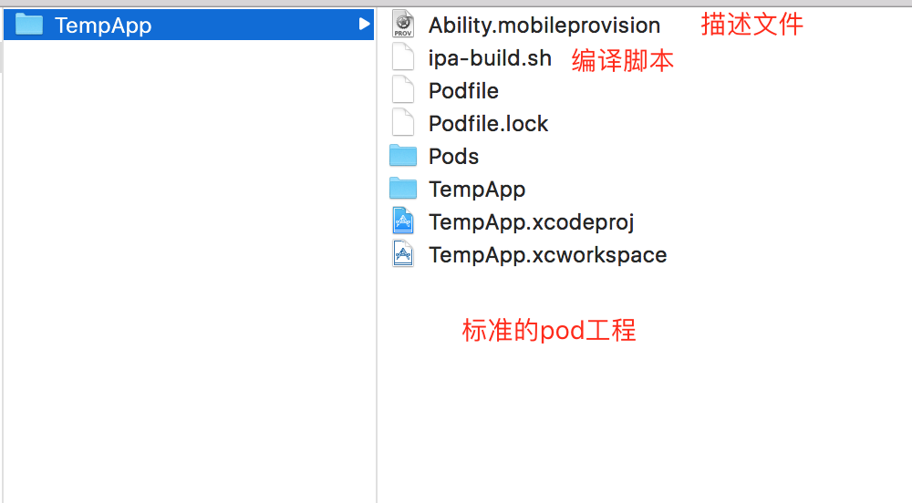
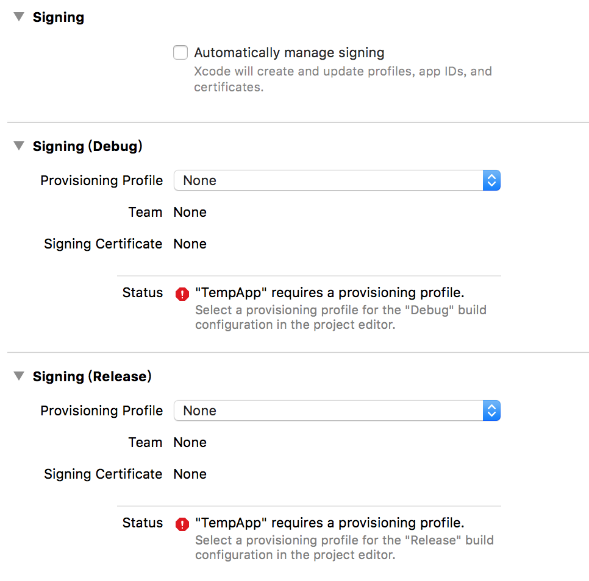
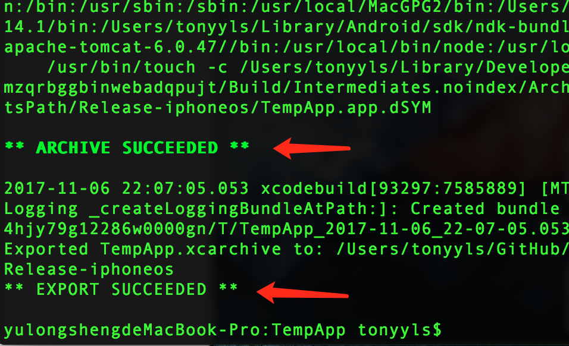
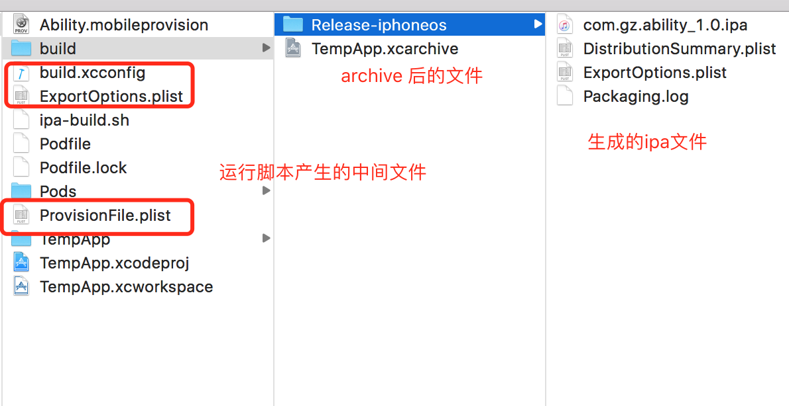

## autobuild-ipa

`ipa-build.sh` 能够帮助iOSer快速打包 ipa(Distribution)

运行环境: Mac OX 10.12.x , XCode 9 , CocoaPods(支持pod命令)

XCode 9 以下的环境均不适用当前脚本，升级XCode9大势所趋！

## 使用
该脚本仅支持`pod工程`的打包（*.workspace）

步骤一：安装开发者证书 (Distribution Cert)。在 KeyChain 中可以查看到该证书则认为已经正常安装。

步骤二：安装描述文件(ProvisionFile)。系统双击安装 `*.mobileprovision`，并将文件拷贝到Pod工程目录。

步骤三：确保是正常运行的pod工程，并且`Signing`中设置成`none`

步骤四：运行`ipa-build.sh`，如果没有权限，需要运行`chmod 777 ipa-build-path`授予权限即可。

如果运行正常如上图所示。

## 实现原理

具体实现原理请查看 `ipa-build.sh`，里面描述了具体思路。